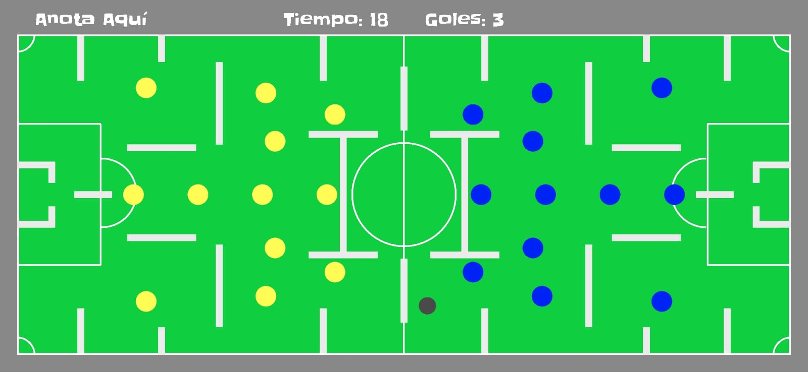

# FUTBOLITO

Futbolito es un juego interactivo en el cual un jugador controla una esfera, que simula un balón de fútbol, utilizando los sensores de su dispositivo móvil. El objetivo es anotar la mayor cantidad de goles en un campo lleno de obstáculos en un tiempo determinado, alternando entre las porterías con cada gol. El juego presenta una dificultad adicional con obstáculos y jugadores que deben ser esquivados para llegar a la portería.

## Características

- **Control de la esfera mediante sensores**: Utiliza el acelerómetro del dispositivo para mover la esfera (balón) en el campo de juego.
- **Porterías alternas**: Cada vez que se anota un gol, la dirección de la portería se cambia, agregando un reto adicional.
- **Obstáculos**: El campo está lleno de obstáculos que dificultan el paso hacia la portería, simulando un laberinto.
- **Contador de goles y tiempo**: En la interfaz se muestra el tiempo restante y la cantidad de goles anotados por el jugador.
- **Interfaz gráfica**: La interfaz muestra el campo de juego, los goles y un cronómetro, todo en tiempo real.

## Objetivo del juego

El objetivo es controlar la esfera (balón) utilizando los movimientos del dispositivo y anotar goles en una de las dos porterías, que cambian después de cada gol. El jugador debe esquivar obstáculos que están distribuidos por el campo y aprovechar los momentos de tiempo que se indican en pantalla. 

## Cómo jugar

1. **Inicia el juego** y mueve tu dispositivo para controlar el balón en el campo.
2. **Anota goles** en la portería indicada por el juego. Después de cada gol, el juego alterna la portería donde debes anotar.
3. **Evita los obstáculos** que están distribuidos en el campo. Si la esfera choca con un obstáculo, su velocidad disminuirá y se ajustará su posición.
4. **Sigue el tiempo**: En la parte superior de la pantalla se muestra un cronómetro con el tiempo restante y la cantidad de goles que has anotado.
5. **Finaliza el juego** cuando el tiempo se agote. Se mostrará la cantidad de goles anotados por el juagdor.

## Imágenes dentro del juego



## Funcionalidades adicionales

- **Detección de goles**: El sistema detecta si el balón entra en las áreas de la portería y suma un gol automáticamente.
- **Cambio de turno**: Después de cada gol, el juego alterna entre las porterías para incrementar la dificultad del jugador.
- **Pantalla de juego**: Se muestra el campo de juego, los obstáculos, las porterías y la puntuación de los jugadores.

## Tecnologías utilizadas

- **Android SDK**: El juego fue desarrollado utilizando Android Studio y el SDK de Android.
- **Sensores del dispositivo**: Se utiliza el acelerómetro del dispositivo para detectar el movimiento y controlar el balón.
- **Gráficos 2D**: La interfaz gráfica se dibuja utilizando la clase `Canvas` de Android, que permite renderizar los elementos del juego como el balón, las porterías y los obstáculos.

## Instalación

1. Clona el repositorio:

    ```bash
    git clone https://github.com/LiroSiza/futbolito.git
    ```

2. Abre el proyecto en Android Studio.

3. Compila y ejecuta el proyecto en un dispositivo Android o en un emulador.

4. Juega y disfruta del reto futbolístico.

## Contribuciones

Si deseas contribuir a este proyecto, por favor haz un fork del repositorio y envía tus cambios mediante un Pull Request. Asegúrate de que tu código sea limpio, bien documentado y probado.

## Licencia

Este proyecto está licenciado bajo la Licencia Apache 2.0.

## Autor

César Torres

---

¡Diviértete jugando Futbolito!
